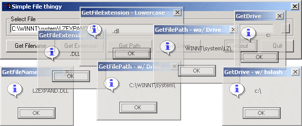



## File String Manipulation \(FIle Thingy\) v1\.01

### Description

(v1.01) -- Some function to manipulate file strings. GetFileName > Returns only the filename -- GetExtension > Returns file extension (optional lowercase) -- GetFileNoExtension (New) > Returns filename without extension -- GetPath > Returns full path. (optional without drive) -- GetDrive > Returns drive (optional include "\") .. Also fixed a horrible bug in the GetFilePath. Screenshot is from v1.0
 
### More Info
 

             |
---                |---
**Submitted On**   |2001-05-25 11:18:50
**By**             |[rudz](https://github.com/Planet-Source-Code/PSCIndex/blob/master/ByAuthor/rudz.md)
**Level**          |Beginner
**User Rating**    |5.0 (10 globes from 2 users)
**Compatibility**  |VB 4\.0 \(32\-bit\), VB 5\.0, VB 6\.0
**Category**       |[Files/ File Controls/ Input/ Output](https://github.com/Planet-Source-Code/PSCIndex/blob/master/ByCategory/files-file-controls-input-output__1-3.md)
**World**          |[Visual Basic](https://github.com/Planet-Source-Code/PSCIndex/blob/master/ByWorld/visual-basic.md)
**Archive File**   |[File Strin200565252001\.zip](https://github.com/Planet-Source-Code/rudz-file-string-manipulation-file-thingy-v1-01__1-22969/archive/master.zip)

